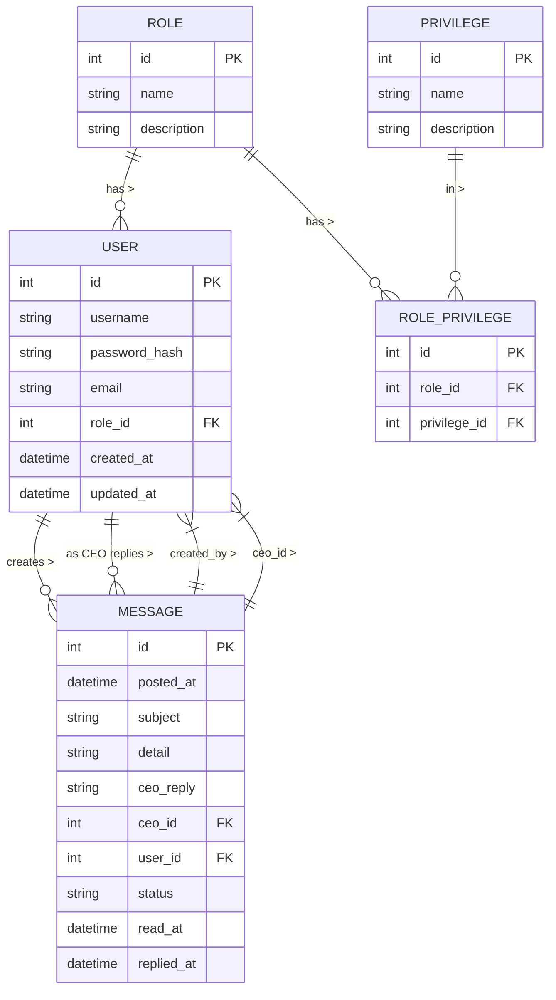

```mermaid
erDiagram
	USER {
		int id PK
		string username
		string password_hash
		string email
		int role_id FK
		datetime created_at
		datetime updated_at
	}
	ROLE {
		int id PK
		string name
		string description
	}
	PRIVILEGE {
		int id PK
		string name
		string description
	}
	ROLE_PRIVILEGE {
		int id PK
		int role_id FK
		int privilege_id FK
	}
	MESSAGE {
		int id PK
		datetime posted_at
		string subject
		string detail
		string ceo_reply
		int ceo_id FK
		int user_id FK
		string status
		datetime read_at
		datetime replied_at
	}

	USER ||--o{ MESSAGE : "creates >"
	ROLE ||--o{ USER : "has >"
	ROLE ||--o{ ROLE_PRIVILEGE : "has >"
	PRIVILEGE ||--o{ ROLE_PRIVILEGE : "in >"
	USER ||--o{ MESSAGE : "as CEO replies >"
	MESSAGE ||--|{ USER : "created_by >"
	MESSAGE ||--|{ USER : "ceo_id >"
```
